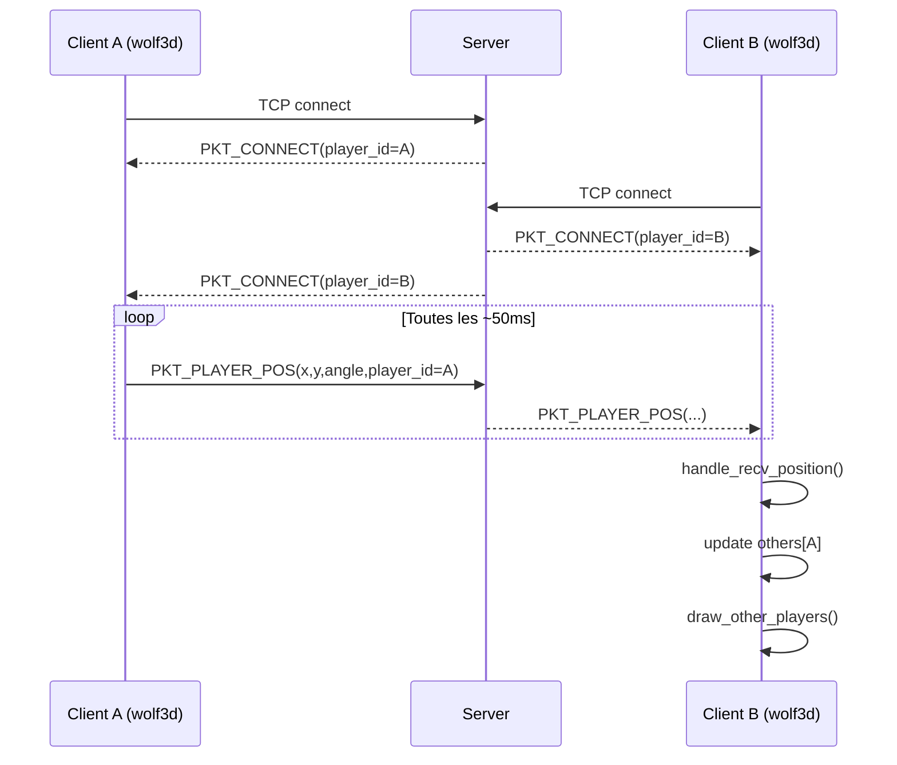

# Documentation reseau Wolf3D

## 1) Objectif

Ce document explique en detail tout le chemin reseau du projet:

- quels binaires sont lances
- quels fichiers font quoi
- comment un client se connecte
- comment les paquets transitent
- comment la position d un joueur arrive jusqu au rendu des autres joueurs
- quelles sont les limites actuelles de l implementation

Le but est de pouvoir debugger, faire evoluer, ou refactor le reseau sans zones floues.

## 2) Vue d ensemble architecture

Le projet compile deux executables:

- `wolf3d`: le client jeu (rendu + input + reseau client)
- `server`: le serveur TCP standalone

Le reseau est base sur SFML Network (TCP), avec un schema simple:

1. Le client ouvre une socket TCP vers le serveur.
2. Le serveur accepte la connexion et assigne un `player_id`.
3. Le serveur envoie un paquet `PKT_CONNECT` au nouveau client.
4. En jeu, chaque client envoie periodiquement sa position (`PKT_PLAYER_POS`).
5. Le serveur fait un relay (broadcast) vers les autres clients.
6. Chaque client met a jour `others[]` et dessine les joueurs distants.

## 3) Cartographie des fichiers reseau

### API commune

- `include/network.h`

Contient:

- constantes (`MAX_PLAYERS`, `PORT`)
- enum des types de paquets (`packet_type_t`)
- format des paquets (`network_packet_t`)
- structures serveur/client (`server_t`, `client_t`)
- prototypes des fonctions client et serveur

### Cote client

- `src/network/client/client.c`
- `src/main.c` (integration reseau dans la boucle de jeu)

Role:

- etablir la connexion TCP
- envoyer les paquets de position
- recevoir les paquets serveur
- mettre a jour les autres joueurs en local

### Cote serveur

- `src/network/server/server.c` (primitives serveur)
- `src/network/server/server_close.c` (fermeture propre)
- `src/network_server.c` (main du serveur et boucle d orchestration)

Role:

- ecouter un port TCP
- accepter les clients
- relayer les paquets recus vers les autres clients

### Build

- `Makefile`

Partie importante:

- `SRC_GAME` inclut le code jeu + client reseau
- `SRC_SERVER` inclut `network_server.c`, `server.c`, `server_close.c`, `client.c`

## 4) Contrat reseau: donnees et types de paquets

## 4.1 Constantes

- `MAX_PLAYERS = 4`
- `PORT = 8080`

## 4.2 Types de paquets

`packet_type_t`:

- `PKT_CONNECT`
- `PKT_DISCONNECT`
- `PKT_PLAYER_POS`
- `PKT_SHOOT`
- `PKT_GAME_STATE`

Dans l etat actuel, le flux actif utilise surtout:

- `PKT_CONNECT`
- `PKT_PLAYER_POS`

## 4.3 Structure du paquet

`network_packet_t` contient:

- `type` (uint8_t)
- `player_id` (uint32_t)
- `timestamp` (uint32_t)
- `x`, `y`, `angle` (float)
- `data[512]` (payload brut reserve pour extensions)

Point cle: le code envoie la structure binaire brute telle quelle (`sfTcpSocket_send` sur le struct). Il n y a pas encore de serialisation explicite (endianness/version/packing).

## 5) Parcours complet d une connexion

## 5.1 Demarrage serveur

Dans `src/network_server.c`:

1. `main()` appelle `block_sigint()`
2. `server_init(&server, PORT)`:
   - cree un listener TCP
   - bind/listen sur le port
   - cree un selector SFML
   - ajoute le listener au selector
   - reset la table `client_sockets[]`
3. `run_server_loop(&server)` demarre la boucle reseau

## 5.2 Connexion client

Dans `src/main.c`, fonction `program()`:

1. `client_init(&wolf->net, "127.0.0.1", PORT)`
2. Dans `client_init` (`src/network/client/client.c`):
   - conversion IP string -> `sfIpAddress`
   - creation socket TCP
   - tentative de connexion (timeout 500 ms)
   - passage en non bloquant (`sfFalse`)
   - init `player_id = MAX_PLAYERS` (sentinel: id non assigne)

## 5.3 Accept serveur + attribution ID

Dans `run_server_loop`:

1. attente `sfSocketSelector_wait(..., 50 ms)`
2. si listener pret: `handle_new_connection()`
3. `server_accept_client()`:
   - accepte la socket
   - prend le slot `nb_players`
   - ajoute la socket au selector
   - incremente `nb_players`
4. creation d un paquet `PKT_CONNECT` avec:
   - `player_id = slot`
   - `timestamp = time(NULL)`
5. envoi du paquet au nouveau client (`server_send_to_client`)
6. broadcast du meme paquet aux autres (`server_broadcast_to_others`)

## 5.4 Reception cote client

Dans `network_update()` (`src/main.c`):

1. boucle `while (client_recv_packet(...) > 0)`
2. dispatch:
   - `handle_recv_packet()` traite `PKT_CONNECT`
   - `handle_recv_position()` traite `PKT_PLAYER_POS`

`handle_recv_packet()`:

- ignore tout sauf `PKT_CONNECT`
- si le client n a pas encore d id (`MAX_PLAYERS`), prend `pkt->player_id`
- applique un spawn special si `player_id == 1`

## 6) Parcours complet d une position joueur

Chemin exact d une position locale vers les autres clients:

1. Le joueur local bouge (input + simulation locale).
2. A chaque frame, `network_update()` est appelee.
3. Si le client est connecte, en mode `GAME`, et avec id valide, `network_send()` peut envoyer.
4. `network_send()` est throttle a 50 ms via `send_clock` (environ 20 envois/s).
5. Le paquet est rempli:
   - `type = PKT_PLAYER_POS`
   - `x`, `y`, `angle` depuis `wolf->player`
6. `client_send_packet()` force `packet->player_id = client->player_id` puis envoie.
7. Le serveur detecte la socket prete et appelle `handle_client_data()`.
8. `server_recv_from_client()` lit le paquet.
9. Si lecture OK, `server_broadcast_to_others(server, &pkt, i)`.
10. Tous les clients sauf emetteur recoivent le paquet.
11. Chez chaque client recepteur:
    - `handle_recv_position()` met a jour `wolf->others[player_id]`
    - met a jour `wolf->nb_others` si besoin
12. Pendant le rendu (`stage()`):
    - `draw_other_players(wolf)` projette et dessine `others[]`

## 7) Boucle serveur detaillee

`run_server_loop(server)`:

1. tant que `!should_stop()`
2. attend des evenements reseau (timeout 50 ms)
3. traite connexion entrante eventuelle
4. traite chaque client actif pret en lecture

Details de stop:

- `block_sigint()` bloque `SIGINT`
- `should_stop()` teste si `SIGINT` est en attente via `sigpending`
- le serveur peut sortir de boucle puis appeler `server_close()` proprement

## 8) Gestion des erreurs et cas limites

## 8.1 Cote client

- `client_init` retourne `-1` si creation/connect echoue
- `client_send_packet`:
  - `sfSocketDone` et `sfSocketNotReady` sont consideres non fatals
  - sinon retourne `-1`
- `network_send` met `wolf->connected = 0` si envoi echoue

## 8.2 Cote serveur

- `server_recv_from_client` nettoie la socket sur `Disconnected` ou `Error`
- le pointeur socket du slot passe a `NULL`

## 8.3 Limites actuelles importantes

1. Allocation de slot:
   - le slot est base sur `nb_players` qui s incremente
   - pas de decrement quand un client quitte
   - risque de ne plus accepter de nouveaux joueurs apres des deconnexions
2. Protocole brut:
   - envoi direct du struct C
   - pas de normalisation reseau (endianness, version, checksum)
3. Types non exploites:
   - `PKT_DISCONNECT`, `PKT_SHOOT`, `PKT_GAME_STATE` non implementes bout a bout
4. Adresse serveur hardcodee:
   - client connecte a `127.0.0.1`
5. Fiabilite temporelle:
   - pas d interpolation/extrapolation des positions distantes

## 9) Sequence simplifiee

## 10) Checklist debug rapide

Si un joueur ne voit pas les autres:

1. verifier que `server` tourne et ecoute le port 8080
2. verifier que le client est bien `connected`
3. verifier reception de `PKT_CONNECT` (id assigne)
4. verifier que le client est en state `GAME`
5. verifier emission periodique de `PKT_PLAYER_POS`
6. verifier `server_recv_from_client` > 0
7. verifier `server_broadcast_to_others` execute
8. verifier `handle_recv_position` met a jour `others[]`
9. verifier `draw_other_players` appele pendant le rendu

## 11) Resume court

Le reseau actuel est un relay TCP simple:

- Client -> envoi position
- Serveur -> redistribue aux autres
- Client recepteur -> met a jour tableau `others[]` et rend les joueurs distants

Il est fonctionnel pour synchroniser position/angle, mais il reste des evolutions a faire pour robustesse production (gestion de slots, protocole serialize, gestion de deconnexion explicite, interpolation, securite).
